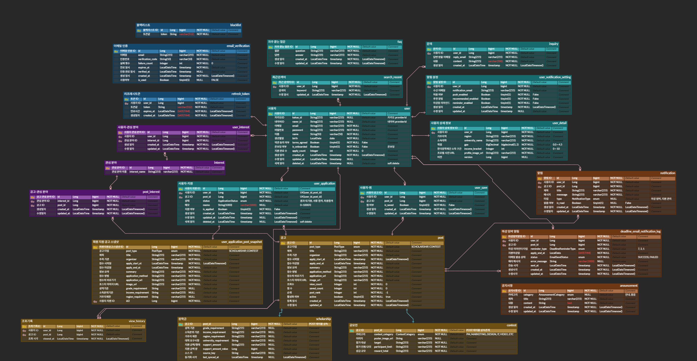
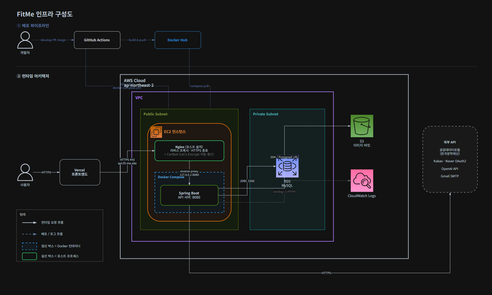

# 🎓 FitMe Backend

> **대학생 맞춤형 장학금 · 공모전 추천 및 지원 이력 관리 서비스 - 백엔드**

> 배포링크 (https://fit-me-front-smoky.vercel.app/)
## 📌 프로젝트 소개

**FitMe**는 대학생들이 자신에게 맞는 장학금과 공모전 정보를 효율적으로 탐색하고,
지원 이력과 진행 상태를 한 곳에서 관리할 수 있도록 돕는 서비스입니다.

백엔드에서는 사용자, 공고, 지원 이력, 찜, 알림 등의 핵심 도메인을 관리하며,
REST API를 통해 서비스의 주요 기능을 제공합니다.

## ✨ 주요 기능

- 관심사 기반 장학금 · 공모전 조회 및 추천
- 지원 이력 생성, 조회, 상태 관리
- 지원 이력 메모 관리
- 찜(북마크) 기능
- 마이페이지 및 활동 정보 관리
- 소셜/폼 로그인 및 이메일 인증
- 공고 탐색 기능
- 마감일 알림 기능

## 🗂️ ERD


## 🏗️ 인프라 구성도


## 🛠️ 기술 스택

### Language & Build

| 구분       | 기술                                    |
| -------- | ------------------------------------- |
| Language | Java 21 (Eclipse Temurin)             |
| Build    | Gradle 8.14.5 (Gradle Wrapper)        |
| Library  | Lombok                                |

### Framework

| 구분         | 기술                                                        |
| ---------- | --------------------------------------------------------- |
| Framework  | Spring Boot 3.5.16                                        |
| Web        | Spring Web MVC, Spring Validation                          |
| Persistence| Spring Data JPA (Hibernate), QueryDSL 5.1.0 (Jakarta)      |
| Security   | Spring Security, Spring Security OAuth2 Client, JJWT 0.13.0 |
| HTTP Client| RestClient, WebClient (Spring WebFlux)                     |
| Mail       | Spring Boot Mail (Gmail SMTP)                              |
| Scheduling | Spring `@Scheduled` (스케줄러 전용 스레드 풀)                        |

### Database

| 구분       | 기술                                              |
| -------- | ----------------------------------------------- |
| Database | MySQL (mysql-connector-j)                        |
| Test DB  | MySQL 테스트 전용 스키마 (`fitme_test`, `create-drop`)   |

### Test

| 구분      | 기술                                                           |
| ------- | ------------------------------------------------------------ |
| Test    | JUnit 5, Mockito, AssertJ, Spring Boot Test, Spring Security Test |
| 테스트 범위  | `@SpringBootTest`, `@WebMvcTest`, `@DataJpaTest`              |

### Infra & DevOps

| 구분            | 기술                                                        |
| ------------- | --------------------------------------------------------- |
| CI/CD         | GitHub Actions (develop 브랜치 PR merge 시 자동 빌드 · 배포)         |
| Container     | Docker, Docker Compose, Docker Hub                         |
| Infra         | AWS EC2, AWS S3 (AWS SDK for Java v2)                      |
| Logging       | SLF4J + Logback, MDC 기반 요청 추적(traceId · userId), ECS 구조화 로그(운영), AWS CloudWatch Logs |

### API & 문서화

| 구분                | 기술                                       |
| ----------------- | ---------------------------------------- |
| API Documentation | Swagger UI (springdoc-openapi 2.8.16)     |
| External API      | 공공데이터포털(한국장학재단 학자금지원정보), Kakao · Naver OAuth2, OpenAI API (gpt-4o-mini) |

### Collaboration

| 구분            | 기술                              |
| ------------- | ------------------------------- |
| Collaboration | GitHub (Issue · PR 템플릿), Notion |


## 📂 프로젝트 구조

도메인 중심(DDD) 구조를 기반으로 각 도메인을 독립적으로 관리합니다.

```text
src/main/java/umc/fitme/
    ├── domain
    │   ├── auth                    # 인증 도메인 (리프레시 토큰 · 블랙리스트 · 이메일 인증)
    │   │   ├── controller          # 컨트롤러
    │   │   ├── converter           # 컨버터
    │   │   ├── dto                 # DTO
    │   │   ├── entity              # 엔티티
    │   │   ├── enums               # Enum들
    │   │   ├── exception           # 예외 (code: 도메인별 에러 코드)
    │   │   ├── repository          # 레포지토리
    │   │   └── service             # 서비스
    │   ├── interest                # 관심사 도메인
    │   │   └── entity/mapping      # 연관관계 매핑 엔티티 (UserInterest, PostInterest)
    │   ├── notify                  # 알림 도메인
    │   │   ├── scheduler           # 마감일 알림 스케줄러
    │   │   └── util                # 알림 표시용 유틸 (상대 시간 포맷)
    │   ├── onboarding              # 온보딩 도메인 (controller · dto · exception · service)
    │   ├── post                    # 공고 도메인 (Post · Scholarship · Contest · ViewHistory 엔티티)
    │   │   ├── client              # 외부 API 클라이언트 (공공데이터, OpenAI 요약)
    │   │   ├── sync                # 장학금 공고 동기화 (client · parser · scheduler · service 등)
    │   │   └── util                # 공고 파싱 유틸 (금액 파서, 대학 유형 판별)
    │   └── user                    # 사용자 도메인
    │       └── entity/mapping      # 연관관계 매핑 엔티티 (지원 이력, 찜)
    ├── global
    │   ├── apiPayload              # 공통 응답 포맷 · 성공/에러 코드 · 전역 예외 핸들러
    │   ├── config                  # 전역 설정 (Security, Swagger, QueryDSL, S3, WebClient 등)
    │   ├── entity                  # 공통 베이스 엔티티 (BaseEntity)
    │   ├── logging                 # 요청 단위 로그 추적을 위한 MDC 필터
    │   ├── scheduler               # 공고 만료 처리 · AI 요약 생성 스케줄러
    │   └── security                # JWT · OAuth2 인증 (filter · handler · service · util)
    └── FitmeApplication.java
```

## 📏 Convention
프로젝트 개발 컨벤션은 아래 문서에서 확인할 수 있습니다.

👉 [프로젝트 컨벤션 (Notion)](https://difficult-grass-c0f.notion.site/e2751793c00a82a993b801e2c81ba654?source=copy_link)

## 👥 Team

| 이름 | 담당                  | GitHub |
|------|---------------------|--------|
| 장문경 | 찜 · 온보딩 API         | [@jangmk05](https://github.com/jangmk05) |
| 김태리 | 마이페이지 API           | [@lucky7terry](https://github.com/lucky7terry) |
| 육도연 | 홈 API               | [@yookdy](https://github.com/yookdy) |
| 홍진우 | 지원 이력 API           | [@j2nooh](https://github.com/j2nooh) |
| 김강민 | 인증 · 탐색 API, DevOps | [@kkangmen](https://github.com/kkangmen) |
